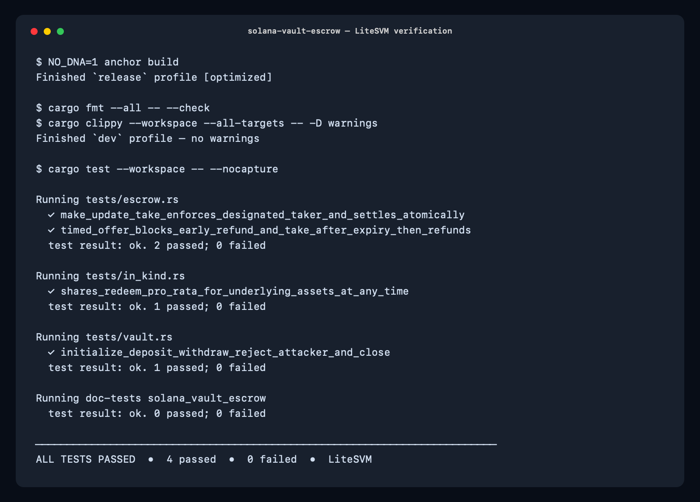

# Solana Vault and Escrow

Week 2 assignment: a SOL vault and an SPL token escrow, both in Anchor. Plus both optional extras: a timed escrow and a non-custodial in-kind redemption vault.

Tests run locally with LiteSVM.

## What it does

**Vault**
- Deposit and withdraw SOL from your own vault.
- Only the owner can withdraw or close it.
- Closing returns all SOL and rent.

**Escrow**
- `make`: lock up token A, ask for token B.
- `update`: change the ask, only if you're the maker.
- `take`: the swap happens atomically. Taker gets token A, maker gets token B, in one transaction.
- `refund`: maker gets token A back and the escrow closes.

**Timed escrow (extra)**
- An offer can carry a deadline. Before it, only the chosen taker can take the offer and the maker can't refund. After it, only a refund works.

**In-kind redemption (extra)**
- A pool holding two tokens that issues share tokens. Burn shares any time and get your slice of both tokens back. No need to wait for liquidity, and no admin can block a valid redemption.

## Run it

```bash
NO_DNA=1 anchor build
cargo test --workspace -- --nocapture
```



## Code

```
programs/solana-vault-escrow/src/
├── instructions/vault.rs      # SOL vault
├── instructions/escrow.rs     # escrow + timed escrow
├── instructions/in_kind.rs    # in-kind redemption pool
└── state.rs                   # account layouts
```

Tests are in `tests/vault.rs`, `tests/escrow.rs`, `tests/in_kind.rs`.

## License

MIT
